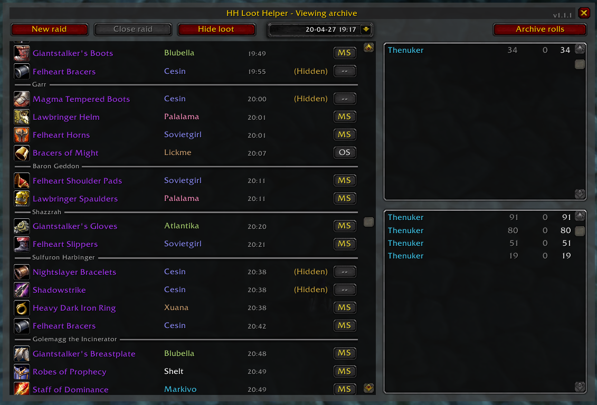
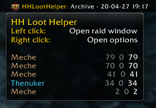

## Held Hostile Loot Helper

A World of Warcraft Classic addon for tracking raid loot and rolls using a simple Main spec (MS), Off spec (OS) loot system with rolls and a -20 penalty for each received MS item.

### Features

- Loot pickup tracking
- Edit loot action and recipient after pickup
- Roll tracking, including penalty based on previous loot
- Syncronization of tracking with other players in the raid
- LibDataBroker integration (for Titan Panel and similar addons)

### Main window

### Titan panel integration

